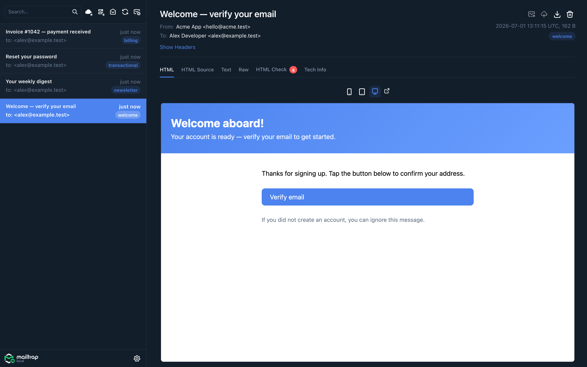
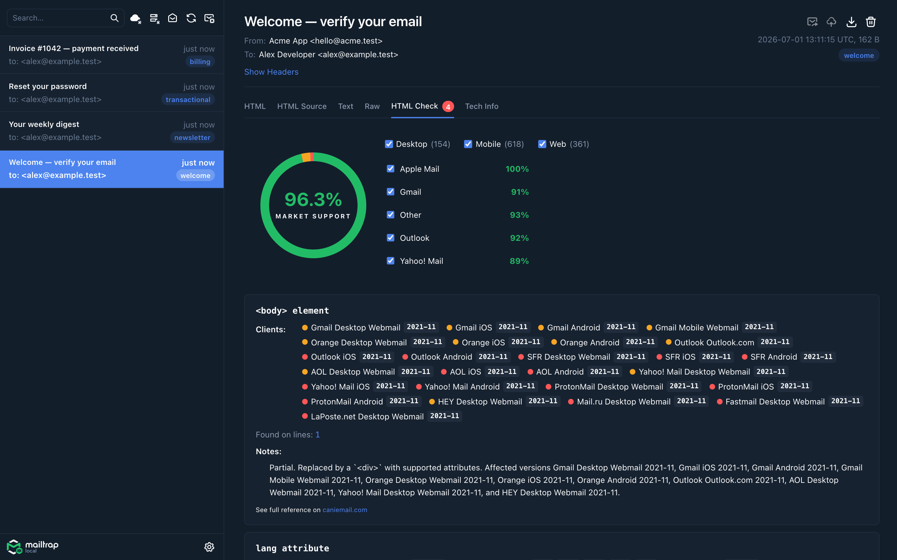
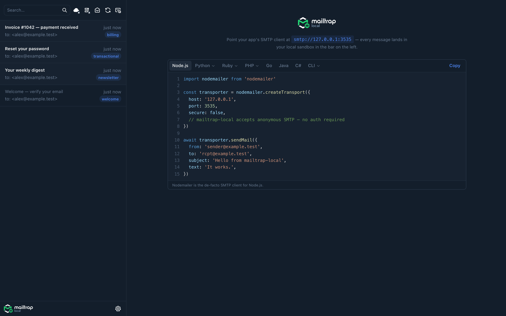
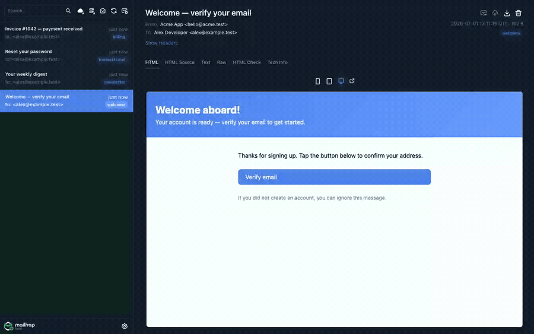

# mailtrap-local

[](https://github.com/mailtrap/mailtrap-local/actions/workflows/ci.yml)

A local **email sandbox + catcher** for **individual developers**. Runs on your laptop, catches every email your app sends, and gives you a web sandbox to browse, search, and inspect them in. One self-contained binary. Open source. MIT-licensed.

## What it does

- **SMTP server on `127.0.0.1:3535`** — point any app at it; every message you send locally gets caught.
- **Web sandbox on `127.0.0.1:3550`** — search, view, inspect HTML/text/raw/headers/attachments.
- **REST API on `127.0.0.1:3550`** — JSON over HTTP; existing API clients only need a host override.
- **Validation tools:** HTML email-client compatibility check across major mail clients.
- **Workflow:** categories, message release to production SMTP, outbound webhooks, sendmail-replacement binary mode.

## Screenshots

Browse caught messages, preview rendered HTML, and inspect client compatibility — all offline, on your machine.

| Inbox + HTML preview | HTML Check | Getting started (code samples) |
|---|---|---|
|  |  |  |



## What it is *not*

- **Not a team tool.** No user accounts, no authentication, no multi-tenancy, no shared sandboxes, no API tokens, no RBAC.
- **Not infrastructure.** No Postgres support, no high-availability, no Prometheus metrics, no Kubernetes probes. SQLite only. Localhost only.
- **Not a Mailtrap Sandbox replacement.** If you need team features and cloud setup, use [Mailtrap](https://mailtrap.io) — the hosted product this tool complements.

## Stack

| Component | Technology |
|---|---|
| Single binary | Go 1.26+ — SMTP, HTTP/JSON API, embedded SPA, all in one process |
| SMTP ingest | [`emersion/go-smtp`](https://github.com/emersion/go-smtp) + [`jhillyerd/enmime`](https://github.com/jhillyerd/enmime) |
| HTTP routing | [`go-chi/chi`](https://github.com/go-chi/chi) |
| Storage | SQLite via [`modernc.org/sqlite`](https://pkg.go.dev/modernc.org/sqlite) (pure Go — no CGo) |
| Web UI | React 19 + tailwindcss + Radix UI + Vite, embedded into the binary at build time via `//go:embed` |
| Realtime | Plain WebSocket (`/cable`) |
| Distribution | `brew install`, `docker run`, single static binary (macOS + Linux; Windows not yet) |

## Quick start

### Homebrew (macOS / Linux)

```sh
brew tap mailtrap/local
brew install mailtrap-local
brew services start mailtrap-local
```

Then open **http://127.0.0.1:3550** and point your app's SMTP client at **127.0.0.1:3535**.

### Docker

```sh
docker run --rm \
  -p 3535:3535 -p 3550:3550 \
  -v mailtrap-local:/var/lib/mailtrap-local \
  ghcr.io/mailtrap/mailtrap-local:latest
```

The same image is mirrored to Docker Hub at `mailtrap/mailtrap-local:latest`.

### Prebuilt binary

Download the right archive for your platform from [the Releases page](https://github.com/mailtrap/mailtrap-local/releases), extract, and run:

```sh
tar xzf mailtrap-local_<version>_<os>_<arch>.tar.gz
./mailtrap-local
```

On macOS, a one-time Gatekeeper bypass is required because the binary isn't notarized:

```sh
xattr -d com.apple.quarantine ./mailtrap-local
```

### From source

```sh
git clone https://github.com/mailtrap/mailtrap-local && cd mailtrap-local
scripts/build.sh         # builds frontend + Go binary → bin/mailtrap-local
bin/mailtrap-local
```

`go install github.com/mailtrap/mailtrap-local/cmd/mailtrap-local@latest` also works for Go developers, but installs the build-time placeholder UI instead of the real React SPA — Vite isn't part of `go install`. Use one of the channels above for the real UI.

`bin/mailtrap-local` listens on `127.0.0.1:3535` (SMTP) and `127.0.0.1:3550` (HTTP+UI+API) by default. Pass `--http-listen`, `--smtp-listen`, `--db`, or `--version` to override.

### Sendmail-replacement mode

Symlink (or rename) the binary to `sendmail` and put it on `$PATH`:

```sh
ln -sf "$(brew --prefix)/bin/mailtrap-local" /usr/local/bin/sendmail
```

PHP's `mail()`, cron, mailx, and anything else that shells out to `sendmail -t -i` will hand the message off to the local sandbox. The binary detects it was invoked as `sendmail` (or `mailtrap-sendmail`, or via `mailtrap-local sendmail …`) and switches modes automatically.

## Development setup

```sh
# Prereqs: Go 1.26+, Node 22+, foreman (optional, for bin/dev)
# Install via mise/asdf using .tool-versions, or directly.

bin/setup           # go mod download + npm install
bin/dev             # boots backend + Vite concurrently (Procfile.dev)
```

In dev:

| Port | Served by | Purpose |
|---|---|---|
| `3535` | `go run ./cmd/mailtrap-local` | SMTP ingest |
| `3540` | Vite dev | SPA — proxies `/api` + `/cable` to backend |
| `3550` | Go binary | JSON API + WebSocket |

Open **http://127.0.0.1:3540** for the dev UI (with HMR). The production single-binary serves the same UI at **http://127.0.0.1:3550** out of the embedded `dist/`.

## Repository layout

```
mailtrap-local/
├── cmd/mailtrap-local/      # main + sendmail dispatch + embed staging
├── internal/
│   ├── api/                 # chi handlers, wire types, SPA serving
│   ├── smtpd/               # go-smtp wrapper + enmime ingest
│   ├── store/               # SQLite schema + queries
│   ├── jobs/                # cloud mirror / relay / webhook / retention
│   ├── htmlcheck/           # HTML email compatibility rule engine
│   ├── live/                # in-process pub-sub for WebSocket
│   ├── relay/               # outbound SMTP relay client
│   ├── webhook/             # outbound webhook signed-POST client
│   ├── cloud/               # Mailtrap sandbox API client
│   └── config/              # YAML config loader
├── frontend/                # React + Vite SPA (built into cmd/mailtrap-local/dist/)
├── docs/
│   ├── api/openapi.yaml    # API spec (embedded + served at /api/v1/openapi.yaml)
│   └── images/             # README screenshots + demo GIF
├── scripts/build.sh         # frontend build + go build → bin/mailtrap-local
├── Dockerfile               # multi-stage source build (Node → Go → distroless)
├── Dockerfile.goreleaser    # release-time wrapper (goreleaser-built binary → distroless)
├── .goreleaser.yaml         # release pipeline: binaries + Homebrew tap + GHCR + Docker Hub
└── .github/workflows/       # ci.yml + release.yml
```

The Homebrew formula lives in a separate tap repo (`mailtrap/homebrew-local`); `goreleaser` opens a formula PR there on every tag.

## API

The full OpenAPI 3.1 specification is at [`docs/api/openapi.yaml`](docs/api/openapi.yaml). When the app is running, the same spec is served at [`http://127.0.0.1:3550/api/v1/openapi.yaml`](http://127.0.0.1:3550/api/v1/openapi.yaml). A bare GET on `/api/v1` redirects to the hosted docs at <https://docs.mailtrap.io/>.

## Configuration

Optional YAML config at `$XDG_CONFIG_HOME/mailtrap-local/config.yml` (or `~/.config/mailtrap-local/config.yml`). Sections:

- `storage.max_messages` — retention cap (oldest evicted past the limit).
- `cloud` — Mailtrap sandbox API token + sandbox ID for the "Send to Cloud" button.
- `relay` — outbound SMTP relay credentials for the "Release" button.
- `webhook` — outbound webhook URL + signing secret.

Values support `${ENV_VAR}` interpolation. Keys present in the config file override the equivalent values stored in the SQLite DB; pinned fields are read-only in the UI.

## Tests

```sh
go test ./...
```

Unit + integration tests cover the store, API, SMTP server, jobs dispatcher, HTML check, and sendmail mode. The OpenAPI drift test (`internal/api/openapi_drift_test.go`) fails the build if a route is added to chi without speccing it (or vice versa).

## License

MIT — see [LICENSE](LICENSE).
